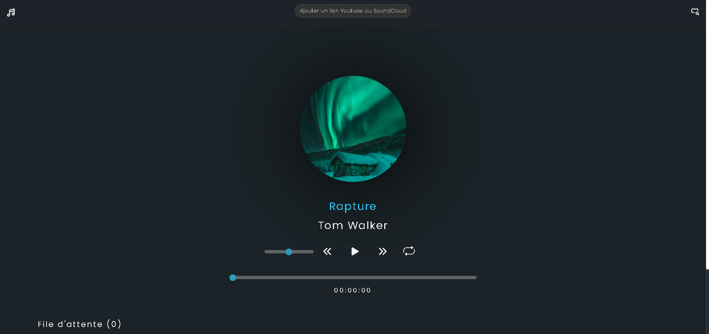
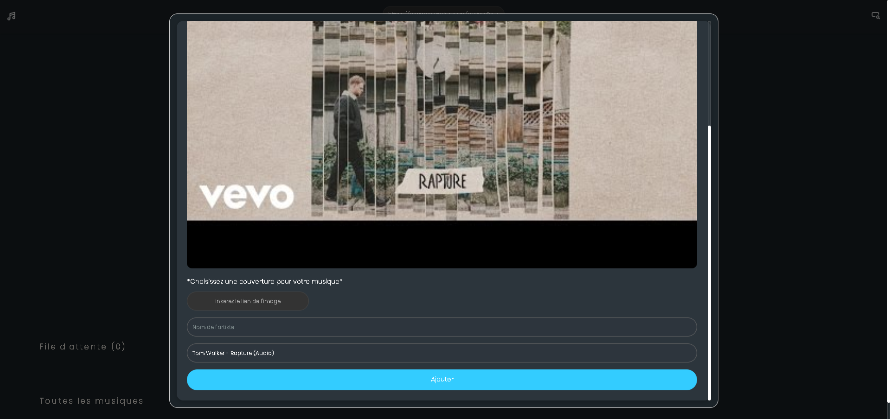

<div align="center">

# 🎵 **React Music Player** 🎵

A modern, feature-rich music player built with React, supporting YouTube and SoundCloud playback for a seamless music experience.


</div>

---

## 🚀 **Project Status**

> 🚧 **In Development**: New features and improvements are added regularly. Stay tuned! 🎧

---

## ✨ **Features**

- 🎵 **YouTube & SoundCloud Integration** – Stream music directly.
- 📱 **Responsive Design** – Enjoy on any device.
- 🎨 **Modern UI & Animations** – Smooth and visually appealing.
- 🎶 **Queue Management** – Control your upcoming tracks.
- 🔄 **Repeat Functionality** – Never miss a beat.
- 🎚️ **Volume Control** – Fine-tune your listening experience.
- 📊 **Real-time Updates** – Powered by GraphQL subscriptions.
- 💾 **Queue Persistence** – Your music stays queued even after refresh.

---

## 🛠️ **Tech Stack**

| 🧩 Category          | 🛠️ Tools                                        |
| -------------------- | ----------------------------------------------- |
| **Frontend**         | React 18, Vite                                  |
| **State Management** | Context API + Reducers                          |
| **Styling**          | TailwindCSS, CSS Modules                        |
| **API Integration**  | Apollo Client, GraphQL, WebSocket Subscriptions |
| **Media Playback**   | react-player                                    |
| **UI Components**    | react-icons, react-modal, react-toastify        |

---

## 🚀 **Getting Started**

### 📦 Prerequisites

- Node.js (v14 or higher)
- npm or yarn

### 🛠️ Installation

```bash
git clone https://github.com/yourusername/react-music-player.git](https://github.com/michel-DC/Music-Player-main.git
cd react-music-player
npm install
```

### 🔑 Environment Setup

Create a `.env` file in the project root:

```env
VITE_DB_KEY=your_hasura_admin_secret
```

### 🚀 Launch the App

```bash
npm run dev
```

---

## 📖 **Usage**

### 🎵 Adding Songs

1. Click the **search bar** in the header.
2. Paste a **valid YouTube or SoundCloud URL**.
3. Fill out the **song details**.
4. Click **Add** to save to your playlist.

### ▶️ Playing Music

- **Play/Pause** your favorite tracks.
- **Skip tracks**, **repeat**, and **adjust volume**.
- **Seek through the song** using the progress bar.

### 📝 Queue Management

- ➕ Add songs via the **+ icon**.
- 🗑️ Remove songs with the **trash icon**.
- 🔄 Queue persists between sessions.

---

## 🎨 **UI Components**

| 🧩 Component  | 📝 Features                                 |
| ------------- | ------------------------------------------- |
| **Header**    | Search bar, responsive layout               |
| **Player**    | Song info, controls, progress & volume bars |
| **Queue**     | Song list, add/remove functionality         |
| **Song List** | Browse, play, and add songs to queue        |

---

## 🔄 **State Management**

Utilizing React’s **Context API** with **Reducers**:

- 🗂️ `SongContext`: Handles current track state.
- 📝 `songReducer`: Manages actions like play, pause, and song selection.

---

## 📡 **API Integration**

- 🗄️ **Queries:** Fetch songs & queue.
- ✍️ **Mutations:** Add/remove songs.
- 🔔 **Subscriptions:** Get live song list updates.

---

## 📱 **Responsive Design**

Optimized for all devices:

- 🖥️ **Desktop:** > 1024px
- 📱 **Tablet:** 508px – 1024px
- 📞 **Mobile:** < 508px

---

## 🧭 **Project Structure**

```bash
react-music-player/
├── src/
│   ├── components/
│   │   ├── Header/
│   │   ├── PlayingNext/
│   │   ├── Queue/
│   │   └── SongCard/
│   ├── context/
│   ├── utils/
│   ├── App.jsx
│   └── main.jsx
├── public/
└── package.json
```

---

## 🛠️ **Available Scripts**

| 📝 Command        | 🚀 Description           |
| ----------------- | ------------------------ |
| `npm run dev`     | Start development server |
| `npm run build`   | Build for production     |
| `npm run preview` | Preview production build |
| `npm run lint`    | Run ESLint               |

---

## 📷 **Screenshots**

### 🏠 Home Page



### 📊 Add a song page



---

## 🤝 **Contributing**

Contributions are welcome! 🚀 Follow these steps:

```bash
git checkout -b feature/AmazingFeature
git commit -m 'Add some AmazingFeature'
git push origin feature/AmazingFeature
```

Then, **open a Pull Request**. Every bit helps! 🙌

---

## 📄 **License**

This project is licensed under the MIT License – see the [LICENSE](LICENSE) file.

---

## 💬 **Contact**

Michel D  
🔗 _Project Link:_ Coming Soon!

---

<div align="center">

❤️ Made with passion by Michel D ❤️

</div>
